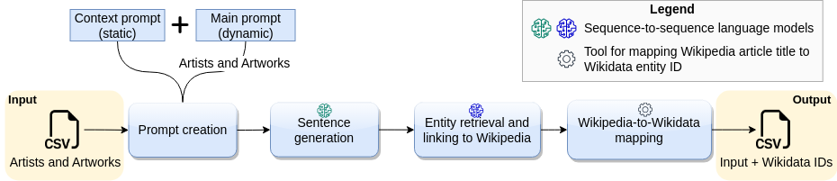

# pArtLink

This tool complements *WES* (another tool of the same repo) with NLP techniques for mapping the artist names to Wikidata entity IDs after mapping them to the most likely Wikipedia article titles. The motivation behind developing this tool was to find links for the more complex cases of artists missed by *WES*, for whom little context is often provided, i.e., the artists' names and titles of their artworks. Our idea was to leverage modern LLMs' retrieval and generative capabilities to enrich the context available for entity alignment.

The workflow of this tool can be divided into the following modules that are arranged sequentially.

1. **Prompt creation**: The prompt creation module generates a template instructing a language model to provide concise, informative sentences about a given artist and their artwork, formatted as "artist_name: info_about_artist," while avoiding unnecessary text.
2. **Sentence generation**: The sentence generation module utilizes a [pre-trained sequence-to-sequence language model called *Llama-2-Chat* with 7 billion parameters](https://huggingface.co/TheBloke/Llama-2-7B-Chat-GGML/blob/main/llama-2-7b-chat.ggmlv3.q4_0.bin), via the *[GPT4ALL](https://github.com/nomic-ai/gpt4all)* project, to generate natural language sentences describing each artist using prompts from the previous module.
3. **Entity retrieval and linking to Wikipedia**: The entity retrieval and linking module identifies artists mentioned in the sentences, retrieves the corresponding Wikipedia article titles for each artist, and, if needed, retrieves multiple titles for disambiguation, using a [sequence-to-sequence language model called *GENRE*](https://github.com/facebookresearch/GENRE). In this work, we used an [instance of this model pre-trained on End-to-End Entity Linking from sentences to Wikipedia](http://dl.fbaipublicfiles.com/GENRE/fairseq_e2e_entity_linking_wiki_abs.tar.gz).
4. **Wikipedia-to-Wikidata mapping**: The final module of the workflow utilizes a [Python library called *Wikimapper*](https://github.com/jcklie/wikimapper) to establish connections between Wikipedia article titles and Wikidata entity IDs. A custom Python method was integrated into *GENRE* to enable *Wikimapper*'s mapping functionality to be applied internally before *GENRE* generates its output.

## Data

### Input

[Artist names and artwork titles](https://drive.google.com/file/d/1DDfIz-15SNe8T7vysWKNBX0P-xe-2q8F/view?usp=drive_link)
in CSV format with columns:
| artist   | artwork  |
|----------|----------|

Explanation:

-  `artist`: Artist's name
-  `artwork`: Title of an artwork created by the artist

### Output

[Linked artists manually evaluated](https://drive.google.com/file/d/1c7xpb-ddZX-euwzadizrtZfmF5k3M-M7/view?usp=drive_link)
in CSV format with columns:
| artist | artwork | sentence | wikidata_url | is_correct | correct_wikidata_url | notes |
|--------|---------|----------|--------------|------------|----------------------|-------|

Explanation:

- Tool's output columns:
  -  `artist`: Artist's name
  -  `artwork`: Title of an artwork created by the `artist`
  -  `sentence`: LLM-generated sentence about the `artist`
  -  `wikidata_url`: URL produced by the tool
- Columns filled during manual evaluation:
  -  `is_correct`: "yes"/"no" field indicating if the `wikidata_url` corresponds to the `artist` or not
  -  `correct_wikidata_url`: This field contains the Wikidata URL of the entity that corresponds to the `artist`, in case `is_correct` is "no"
  -  `notes`: Observations made during manual evaluation

## Results

In order to test *pArtLink*, we used as **input 700 artists** in total: the 423 unlinked by *WES* (another tool of the same repo) and 277 of the rest. *pArtLink* found Wikidata entity IDs for 332 artists. We **manually checked the correctness** of these entities. Out of these artists, **117 were left unlinked by *WES*** (i.e., 215 were also linked by *WES*) and **252 were correctly linked to Wikidata**. Also, **76 of the correctly linked artists were artists that *WES* could not link**.

## Usage

### Prerequisites

- Python >=3.8
- [Poetry](https://python-poetry.org/)

### Installation

1. Install dependencies 
   `poetry install`
2. Install *GENRE* by running the [provided Jupyter notebook](src/GENRE_installation.ipynb)

### Preparation

1. Create `data/` directory
2. Activate poetry environment 
   `poetry shell`
3. Download the latest Wikipedia SQL dump 
   `wikimapper download enwiki-latest --dir ./data`
4. Create index of Wikipedia-to-Wikidata mappings 
   `wikimapper create enwiki-latest --dumpdir ./data --target ./data/index_enwiki-latest.db`
5. Download the input file with artist names and artwork titles 
   `gdown https://drive.google.com/uc?id=1DDfIz-15SNe8T7vysWKNBX0P-xe-2q8F`

### Execution

1. Activate poetry environment 
   `poetry shell`
2. Generate sentences for every input artist and artwork 
   `python src/artists_sentence_generation.py`
3. Perform entity linking of input artists to Wikidata 
   `python src/artists_entity_linking.py`
